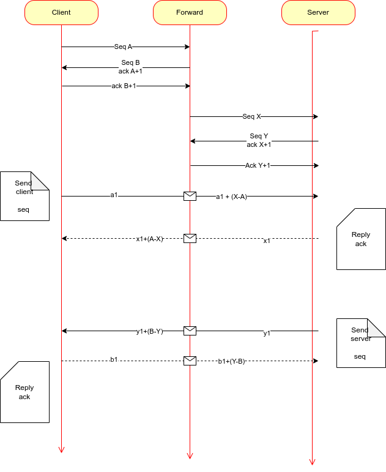

# Forwarder

This project aims to forward data to any destination you want. Unlike kernel LVS, it makes forward decision by your instruction. After client connects to forwarder, the first package sent is used for making decision, then the following data is transmitted as usual.

# Work mechanism

## Connection procedure

Actor:   Client   --->   Forwarder  ---> Real Server

 1. Forwarder create a user program, and listen on a tcp port waiting for client connection.
 2. Client call "connect" system call to connect Forwarder, then send *Instruction* to Forwarder.
 3. After receiving instruction, Forwarder record the connection file description(fd-c), and parse the instruction data. 
 4. After parsing instruction data, Forwarder connect the Real Server, and record the connection file description(fd-s).
 5. After the dual connection is finished, Forwarder build a data struct containing fd-c, fd-s, and the tcp sequence number difference value. Then a acknowledge response to sent back to Client.
 6. Client receives the response,  start the normal data transmission.

`The tcp package seq/ack number should be modified during SNAT/DNAT transmission by Forward server, as some data is consumed by route message parser`

## Program component

 - Connection listener, a daemon running on user mode, aims to accept  the connection from client and parse the instruction data, and initiate connection to real server. Then notify the kernel forwarder the dual connection file description. 
 - Kernel forwarder, a netfilter module running on kernel mode,  modify the package data , and forward it to real server.

# Interface

/proc/forwarder is root folder for configuration, under which the  files  and the corresponding functionality are listed by the following.
- listen_port, sets the tcp port which is listened by connection listener, accepting new connection from clients.
- forward, listener daemon writes socket file description pair to this file, corresponding to the upper fd-c and fd-s.
- show , shows all connection pairs that are handled by forwarder.

